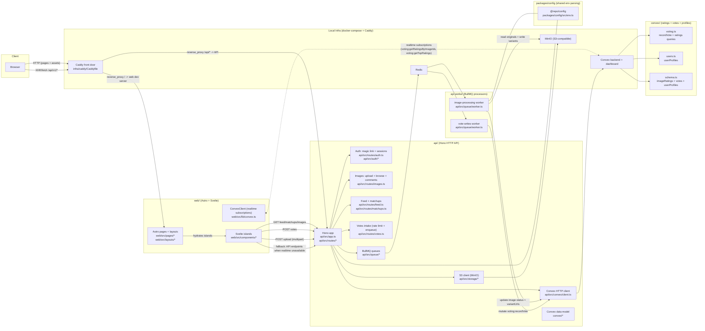
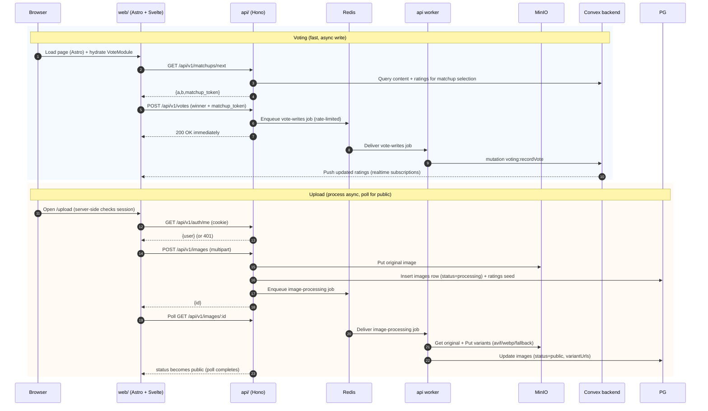

# Junkmail Codebase Diagram

## High-Level Architecture

```mermaid
flowchart LR
  %% ================
  %% Client + Web
  %% ================
  subgraph Client["Client"]
    B["Browser"]
  end

  subgraph Web["web/ (Astro + Svelte)"]
    Astro["Astro pages + layouts\nweb/src/pages/*\nweb/src/layouts/*"]
    Svelte["Svelte islands\nweb/src/components/*"]
    WebConvex["ConvexClient (realtime subscriptions)\nweb/src/lib/convex.ts"]
  end

  %% ================
  %% API + Worker
  %% ================
  subgraph API["api/ (Hono HTTP API)"]
    Hono["Hono app\napi/src/app.ts\napi/src/routes/*"]
    Auth["Auth: magic link + sessions\napi/src/routes/auth.ts\napi/src/auth/*"]
    Images["Images: upload + browse + comments\napi/src/routes/images.ts"]
    Feed["Feed + matchups\napi/src/routes/feed.ts\napi/src/routes/matchups.ts"]
    Votes["Votes intake (rate limit + enqueue)\napi/src/routes/votes.ts"]
    ConvexHttp["Convex HTTP client\napi/src/convex/client.ts"]
    Data["Convex data model\nconvex/*"]
    Storage["S3 client (MinIO)\napi/src/storage/*"]
    Queue["BullMQ queues\napi/src/queue/*"]
  end

  subgraph Worker["api worker (BullMQ processors)"]
    ImgWorker["image-processing worker\napi/src/queue/worker.ts"]
    VoteWorker["vote-writes worker\napi/src/queue/worker.ts"]
  end

  %% ================
  %% Realtime / Ratings
  %% ================
  subgraph Convex["convex/ (ratings + votes + profiles)"]
    CxVoting["voting.ts\nrecordVote + ratings queries"]
    CxUsers["users.ts\nuserProfiles"]
    CxSchema["schema.ts\nimageRatings + votes + userProfiles"]
  end

  %% ================
  %% Infra
  %% ================
  subgraph Infra["Local Infra (docker-compose + Caddy)"]
    Caddy["Caddy front door\ninfra/caddy/Caddyfile"]
    Redis["Redis"]
    MinIO["MinIO (S3-compatible)"]
    ConvexBackend["Convex backend + dashboard"]
  end

  %% ================
  %% Shared config
  %% ================
  subgraph Shared["packages/config (shared env parsing)"]
    PkgConfig["@repo/config\npackages/config/src/env.ts"]
  end

  %% =========
  %% Edges
  %% =========
  B -->|"HTTP (pages + assets)"| Caddy
  Caddy -->|"reverse_proxy / -> web dev server"| Astro
  Astro -->|"hydrates islands"| Svelte

  B -->|"XHR/fetch /api/v1/*"| Caddy
  Caddy -->|"reverse_proxy /api/* -> API"| Hono

  Svelte -->|"GET feed/matchups/images"| Hono
  Svelte -->|"POST votes"| Hono
  Svelte -->|"POST upload (multipart)"| Hono

  WebConvex <-.->|"realtime subscriptions\n(voting:getRatingsByImageIds, voting:getTopRatings)"| ConvexBackend
  Svelte -->|"fallback: API endpoints when realtime unavailable"| Hono

  Hono --> Auth
  Hono --> Images
  Hono --> Feed
  Hono --> Votes

  Hono --> ConvexHttp

  Hono --> Storage
  Storage --> MinIO

  Hono --> Queue
  Queue --> Redis

  Redis --> ImgWorker
  Redis --> VoteWorker

  ImgWorker -->|"read originals + write variants"| MinIO
  ImgWorker -->|"update image status + variantUrls"| ConvexHttp

  VoteWorker -->|"mutate voting:recordVote"| ConvexHttp
  ConvexHttp --> ConvexBackend
  ConvexBackend --> CxSchema
  ConvexBackend --> CxVoting
  ConvexBackend --> CxUsers

  %% shared env parsing
  Hono --- PkgConfig
  ImgWorker --- PkgConfig
```

## Key Flows (Sequence)

```mermaid
sequenceDiagram
  autonumber
  participant Browser
  participant Web as web/ (Astro + Svelte)
  participant API as api/ (Hono)
  participant Redis
  participant Worker as api worker
  participant MinIO
  participant Convex as Convex backend

  rect rgba(240,248,255,0.7)
    note over Browser,Convex: Voting (fast, async write)
    Browser->>Web: Load page (Astro) + hydrate VoteModule
    Web->>API: GET /api/v1/matchups/next
    API->>Convex: Query content + ratings for matchup selection
    API-->>Web: {a,b,matchup_token}
    Web->>API: POST /api/v1/votes (winner + matchup_token)
    API->>Redis: Enqueue vote-writes job (rate-limited)
    API-->>Web: 200 OK immediately
    Redis->>Worker: Deliver vote-writes job
    Worker->>Convex: mutation voting:recordVote
    Convex-->>Web: Push updated ratings (realtime subscriptions)
  end

  rect rgba(255,250,240,0.7)
    note over Browser,PG: Upload (process async, poll for public)
    Browser->>Web: Open /upload (server-side checks session)
    Web->>API: GET /api/v1/auth/me (cookie)
    API-->>Web: {user} (or 401)
    Web->>API: POST /api/v1/images (multipart)
    API->>MinIO: Put original image
    API->>PG: Insert images row (status=processing) + ratings seed
    API->>Redis: Enqueue image-processing job
    API-->>Web: {id}
    Web->>API: Poll GET /api/v1/images/:id
    Redis->>Worker: Deliver image-processing job
    Worker->>MinIO: Get original + Put variants (avif/webp/fallback)
    Worker->>PG: Update images (status=public, variantUrls)
    API-->>Web: status becomes public (poll completes)
  end
```
